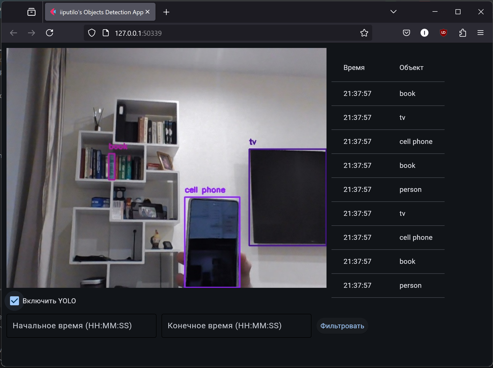

# Object Detection App with YOLOv11

## Description
This is a web application for real-time object detection using the YOLO model. The app captures video from a webcam, performs object detection, and saves the results in an SQLite database. Users can view the list of detected objects and filter them by time.

## Features
- Capture video stream from a webcam.
- Perform object detection using the YOLO model.
- Save detection results (time and object name) to an SQLite database.
- Display detected objects in a table.
- Filter results by a time range.
- Enable/disable detection using a checkbox.
